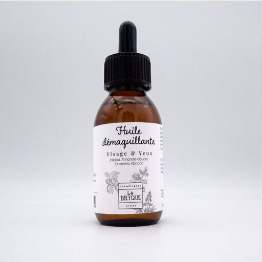

# Segment Anything: Adaptation Challenge

## Prerequisites

- Get access to a machine with a decent NVIDIA GPU
- Install [Refiners](https://github.com/finegrain-ai/refiners): you will need it to solve this challenge

## Background

Segment Anything (SAM) has been designed to solve downstream tasks via prompt engineering which could imply relying on other components like an object detector:

> For example, if one has a bounding box detector for cats, cat instance segmentation can be solved by providing the detector's box output as a prompt to our model.

*See section 2 from the [official paper](https://arxiv.org/abs/2304.02643) for more details.*

As an alternative to this zero-shot approach, it is possible to improve SAM performance on certain tasks by using [**adapters**](https://github.com/finegrain-ai/refiners/tree/main#awesome-adaptation-papers): this is the focus of this challenge.

## Task: Product Segmentation from Packshot Images

Packshots represent a *single* product on a white or neutral background:

### Challenge

The goal is to **train a SAM adapter with [Refiners](https://github.com/finegrain-ai/refiners)** to accurately segment the product by just using the entire image area as a box prompt (which is natural since packshot images are object-centric).

By default, SAM (ViT-H) does not perform well on such kind of inputs, so your adapter should address some or all of these non-exhaustive **issues** (see [packshots/](packshots) for some inputs/outputs):

#### Inverted Foreground-Background

By using the entire image as box prompt (not tight around the product), SAM generally returns a negated mask:

*Left = input, right = SAM output mask (the product should be depicted with white pixels)*

#### Shadows and Reflections

Drop shadows usually fool SAM:

*Left = input, right = SAM output mask (the mask incorporates the shadow)*

Likewise with reflection:

#### Inaccurate Boundaries

SAM could output inaccurate boundaries and/or mask errors like holes:

*Mask overlaid on top of the input image to showcase the inaccuracies*
